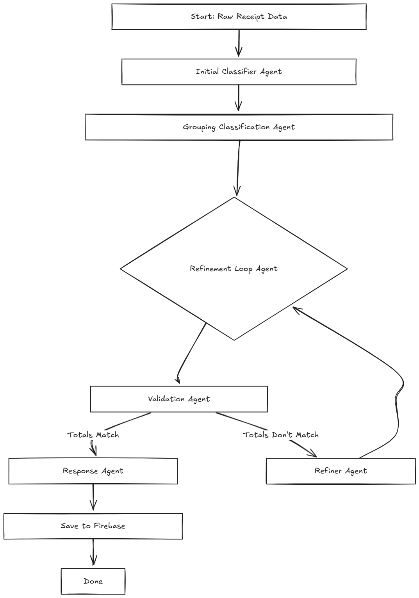
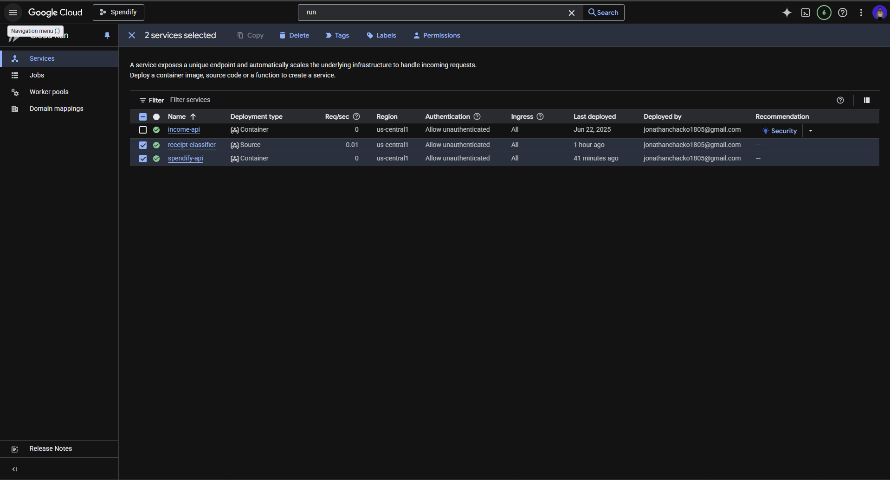
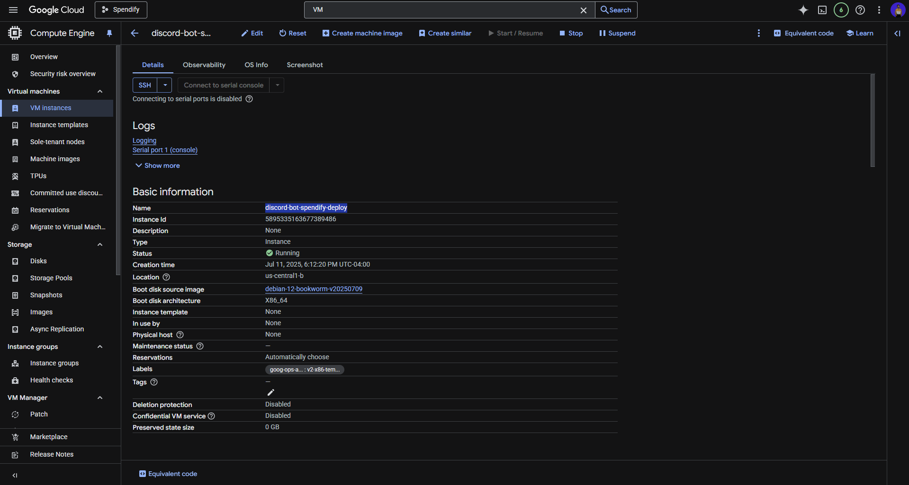
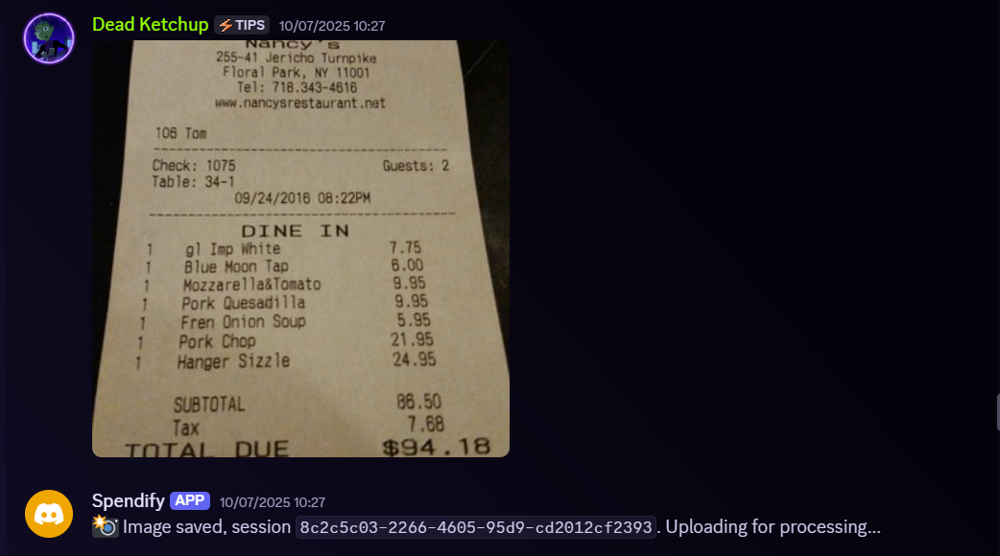
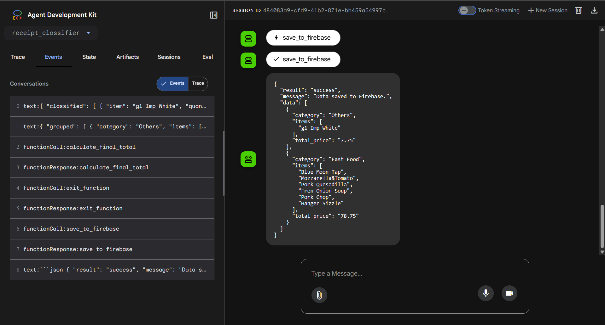
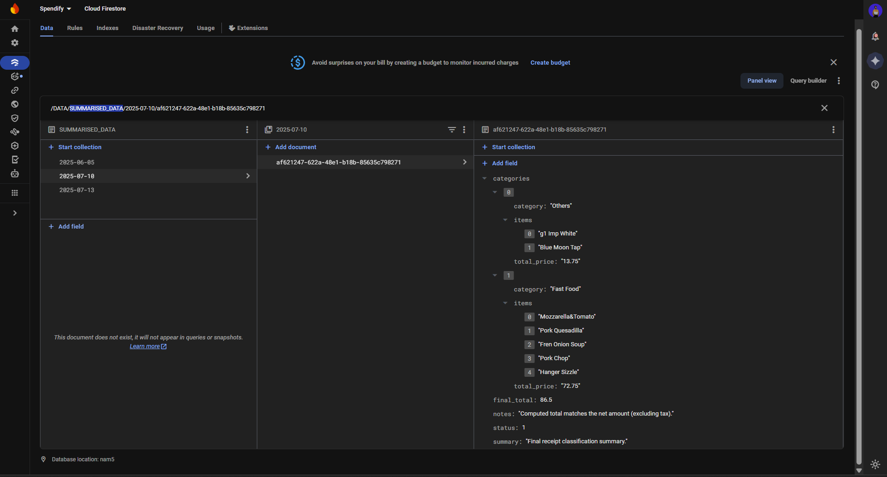
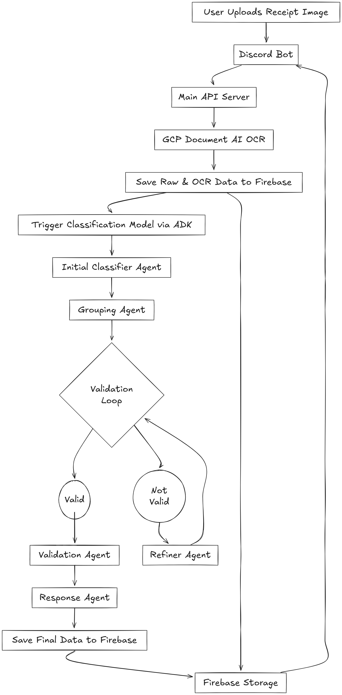

# Milestone 3 (Week 9): Core Model Development & Integration

---

## Focus & Requirements Alignment

### 1. Core Machine Learning Model(s) / AI Components

* **Vertex Document AI (Pre-Trained Model):**

  * Vertex has Document AI which Provides Us with Option of Training or Selecting a Pre-Trained Model to Use.
  * Since Expense Bills are available under the Pre-Trained Model we selected it and have the Option to Fine Tune it in the Future.
* **Classification**:

  * Implemented a highly structured ADK (Agent Development Kit) model pipeline for receipt item classification.
  * Pipeline uses strict, well-defined input and output formats for reliable and explainable classification results.
  * Switched from the previous Ollama-based LLM approach (Milestone 2) to the new multi-agent ADK pipeline for better control, structure, and validation.

  
* **Regression Model (Upcoming)**:

  * A regression model for spend prediction is planned and will be integrated in the next stage (along with the Dashboard).

---

### 2. System Integration

* **Integration Demo**:

  * The `gcp_adk_classification.py` module demonstrates seamless integration between the main application and the ADK classification pipeline.
  * End-to-end flow: Discord bot → Flask API (`main_api.py`) → GCP Document AI OCR → ADK agent pipeline → Firebase storage.
* **Upcoming Dashboard**:

  * A user dashboard to visualize classified and predicted data is planned for the next milestone.

#### **Live API Demonstration/Screenshot**
> Hosting


> Pipeline




* The full pipeline was tested end-to-end:

  * Discord Bot uploads a receipt image
  * API receives and processes the image, runs OCR
  * Data sent to ADK classification pipeline (Initial Classifier → Grouping Agent → Validation/Refinement Loop → Final Response Agent)
  * Classification output is validated and stored in Firebase
* **Result:** API endpoint returns predictions successfully.

---

### 3. Initial Deployment Steps

Deployment guides and step-by-step instructions are provided in the following repository links. For each major component, use the commands below for deployment:

#### **1. ADK Classification Agent**

* Guide: [deploy-adk.md](https://github.com/jcp-tech/Spendify/blob/main/adk_pipeline/deploy-adk.md)
* **Cloud Run Deployment Command:**

```bash
adk deploy cloud_run \
  --project=$GOOGLE_CLOUD_PROJECT \
  --region=$GOOGLE_CLOUD_LOCATION \
  --service_name=$SERVICE_NAME \
  --app_name=$SERVICE_NAME \
  --port=8080 \
  --log_level=info \
  --with_ui \
  ./receipt_classifier
```

#### **2. Flask API**

* Guide: [deploy-api.md](https://github.com/jcp-tech/Spendify/blob/main/flask_api/deploy-api.md)
* **Build & Deploy to Cloud Run:**

```bash
gcloud builds submit --tag gcr.io/$GOOGLE_CLOUD_PROJECT/$SERVICE_NAME .
```

```bash
gcloud run deploy $SERVICE_NAME \
  --image gcr.io/$GOOGLE_CLOUD_PROJECT/$SERVICE_NAME \
  --platform managed \
  --region $GOOGLE_CLOUD_LOCATION \
  --allow-unauthenticated
```

#### **3. Discord Bot**

* Guide: [deploy-bot.md](https://github.com/jcp-tech/Spendify/blob/main/discord_bot/deploy-bot.md)
* **VM Deployment Command:**

```bash
ssh -i ~/.ssh/gcp_key user@VM_IP
```

```bash
tmux new -s discordbot
```

```bash
python3 bot.py
```

Each document contains Dockerfile usage, environment variable setup, GCP Cloud Run deployment, and troubleshooting tips specific to each core component.

---

### 4. Progress, Planning & Next Steps

#### **From Milestone 2 → Milestone 3**

* Major change: Replaced Ollama/LLM-based classification with the robust ADK model pipeline.
* Improved reliability, structure, and validation by enforcing strict input/output schemas and a multi-agent review/refine process.

#### **Detailed Task Breakdown (Next 3 Weeks, by Role)**

* **Regression model implementation & integration (Aliyyah):**

  * Predict user spend (time series/regression)
  * Integrate into existing backend pipeline
* **Dashboard development (Aadil):**

  * Build initial UI for receipt and prediction visualization
  * Connect dashboard to Firebase/API
* **Deployment & system integration (Jonathan):**

  * Deployment of Regression Model and Dashboard
  * Full system end-to-end testing

---

### 5. Challenges Faced to Achieve Milestone 3

* Ollama proved inaccurate and unreliable for classification, which led us to adopt GCP ADK as the primary classification engine.
* Swapping from Ollama to ADK allows us to access the larger computational power of GCP and benefit from a more scalable, production-grade environment.
* Integrating the highly structured ADK model pipeline with strict input/output, which required reworking the entire classification workflow.
* GCP ADK is an amazing tool for building agent pipelines, but it lacks comprehensive documentation and real-world examples, which significantly slowed down development.
* Deployment was difficult for GCP ADK for the same reasons as above, with a lot of trial and error required to achieve a working cloud setup.
* Ensuring compatibility and smooth data handoff between Discord Bot, Flask API, GCP Document AI, and ADK pipeline.
* Debugging Firestore data serialization and managing Firestore schema changes.
* Handling OCR inconsistencies in receipt formats from GCP Document AI.
* Adapting deployment strategies (switching from Ollama to ADK), requiring updates to containerization and cloud setup.

### 6. Remaining Challenges

* **Regression Model:** Need to design and validate regression predictions; may need additional user data.
* **Dashboard:** Ensuring robust connection between dashboard and backend, and handling real-time updates.
* **Validation:** Ensuring ground-truth data for accurate model validation (classification & regression).
* **Performance:** Scaling API/bot for multiple concurrent users; latency testing on cloud.

---

## Proccess Flow
